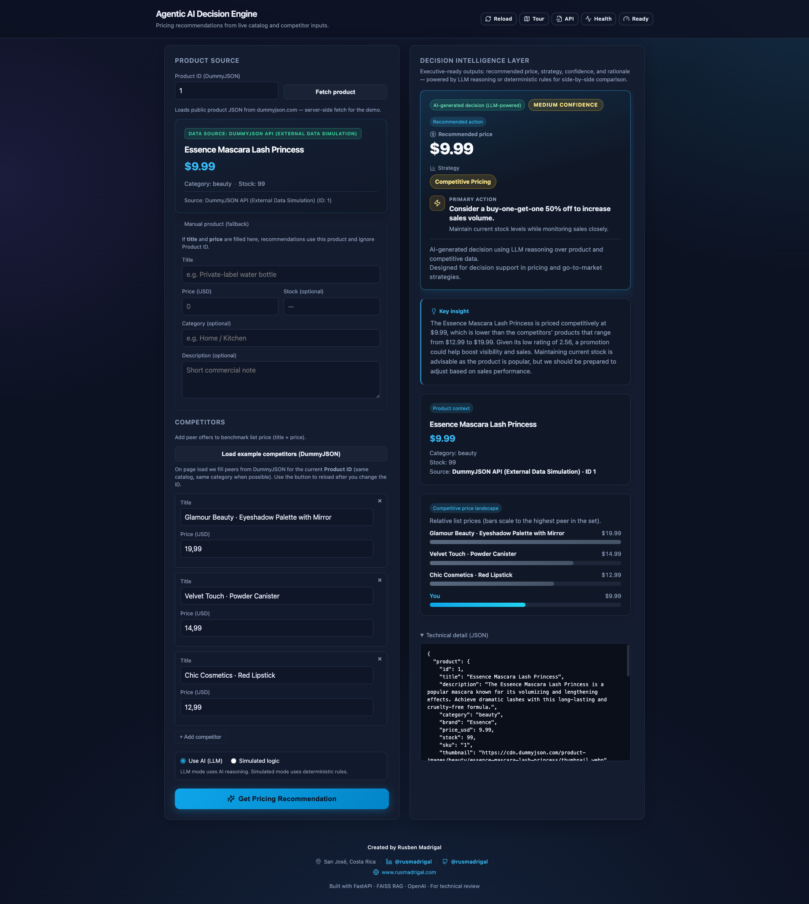

# Agentic AI Decision Engine



## What this project does

**Agentic AI Decision Engine** is a **business-oriented demo** that **turns product and competitor inputs into actionable pricing decisions**. It is built for presentations, interviews, and workshops, with a polished UI aimed at executive-style storytelling.

The flow is:

1. **Data ingestion** — Product from [DummyJSON](https://dummyjson.com) (external catalog simulation) or a **manual product** (SKU / what-if).
2. **Competitor benchmarking** — Title + price rows (typed in, or **example competitors** loaded from the same DummyJSON catalog via API).
3. **Decision engine** — With `OPENAI_API_KEY`, you can use **LLM reasoning** (`use_llm: true`, or the default when a key is present). Without a key, or with **simulated mode**, **deterministic rules** drive pricing, promotion, and inventory guidance using the **same JSON shape**.
4. **Presentation layer** — HTML UI at `/` with a decision hero, **confidence**, insight, product context, and a visual price comparison; stable contract on **`POST /v1/decisions`**.

This is **not** a replacement for an ERP or enterprise pricing platform. It demonstrates **how AI can structure real or simulated inputs into business-ready outputs**.

## For reviewers

1. Start the API (see **Quick start**), open **`http://127.0.0.1:8000/`**, enter a **Product ID**, click **Fetch product**, review competitors (or **Load example competitors**), choose **Use AI (LLM)** or **Simulated logic**, then **Get Pricing Recommendation**. A guided tour is available in the header.
2. **`/docs`** — OpenAPI; try **`POST /v1/decisions`** with `product_id` or `product` + `competitors`, and optional **`use_llm`**.
3. **`GET /api/readiness`** — `openai_configured`, `llm_decisions_ready`, `rag_ready`, etc. (no secrets exposed).

## Quick start (local)

Use **Python 3.10+** (3.11 recommended; the repo may include **`.python-version`**).

```bash
python3.11 -m venv .venv
source .venv/bin/activate
pip install -r requirements.txt

# Optional FAISS index (RAG extension / demos)
python scripts/build_index.py

# Optional: OpenAI embeddings when building the index
export OPENAI_API_KEY=...
export EMBEDDING_MODE=embedding-3-small
python scripts/build_index.py

make dev
# or: uvicorn api.index:app --reload --host 0.0.0.0 --port 8000
```

Open `http://localhost:8000/docs` for interactive API documentation.

### Example `POST /v1/decisions`

```bash
curl -s http://localhost:8000/v1/decisions \
  -H 'content-type: application/json' \
  -d @- <<'JSON'
{
  "product_id": 1,
  "use_llm": false,
  "competitors": [
    { "title": "Brand A", "price": 100 },
    { "title": "Brand B", "price": 130 }
  ]
}
JSON
```

The response includes `product`, `competitors`, `decisions` (strategy, recommended price, promotion, inventory, reasoning, and `confidence` when applicable), `source` (`dummyjson API` | `manual`), and **`decision_engine`** (`llm` | `simulated`).

### Example competitors (DummyJSON)

```http
GET /api/example-competitors/{product_id}?limit=3
```

Returns suggested peer rows from the same catalog (same category when possible).

## Configuration

See **`.env.example`**. Important variables:

| Variable | Purpose |
| --- | --- |
| `OPENAI_API_KEY` | Enables LLM mode on `/v1/decisions` (unless `use_llm` forces otherwise). |
| `OPENAI_CHAT_MODEL` | Defaults to `gpt-4o-mini`. |
| `EMBEDDING_MODE` | `embedding-3-small` or `pseudo` (offline). |
| `OPENAI_EMBEDDING_MODEL` | Defaults to `text-embedding-3-small`. |

Query-time embeddings must stay consistent with how the FAISS index was built.

## Deploying (Render)

- **Blueprint:** `render.yaml` — install dependencies, run `scripts/build_index.py`, start `uvicorn` on `$PORT`.
- **Health:** `GET /health`.
- Set **`OPENAI_API_KEY`** as a secret if you use LLM or OpenAI embeddings at build time.

## Tests

```bash
pytest
```

## Project layout

```
api/index.py              # FastAPI (demo HTML, decisions, DummyJSON)
app/services/             # ai_decision_engine (LLM), rule_decisions (simulated)
app/integrations/         # dummyjson.py
app/rag/                  # FAISS + retriever (extension)
app/static/demo.html      # Demo UI
docs/images/mvp.png       # MVP screenshot
```

## Notes

- The MVP does not require an external database; the RAG corpus is versioned JSON plus an on-disk index.
- DummyJSON is **sample data**; production would wire real sources and policies.

---

## Creator

**Rusben Madrigal**  
San José, Costa Rica  

- LinkedIn: [linkedin.com/in/rusmadrigal](https://www.linkedin.com/in/rusmadrigal)  
- GitHub: [@rusmadrigal](https://github.com/rusmadrigal)  
- Website: [www.rusmadrigal.com](https://www.rusmadrigal.com)  
